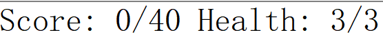

# 玩法说明
## 概述
- 点击底部队员图标，在提示的可部署格子中点击，再点击箭头选择方向

- 敌人从红色格子内出现，目标是蓝色格子，游戏目标是防止敌人进入蓝色格子

## 基本概念

- 敌人出生点（红门）

  - 

  - 敌人由此出现

- 敌人目标点（蓝门）

  - 

  - 敌人的目的地

- 击杀数
  - 即界面左上角的Score
  - 每击败一个敌人即可获得一个击杀数，击杀所有敌人即可获得胜利
- 生命点
  - 即界面左上角的Health
  - 每有一个敌人进入蓝门，扣除一点生命点，生命点归零则游戏失败
    

- cost
  - 在界面的右上角
  - 部署队员需要消耗cost
  - cost会随时间恢复，职业为先锋的队员也可以恢复cost

- 地图格子
  - 除了蓝门和红门外，还有地面格子和高台格子
  - 每个格子都有可部署与不可部署的属性
  - 可部署地面
  - 不可部署地面
  - 可部署高台
  - 不可部署高台

- 队友
  - 游戏开始时会出现在屏幕底部的待部署栏中
  - 在待部署栏中时，左上角显示部署需要的cost，右上角显示职业
  - 队友的阻挡数即可以阻挡敌人的数量
  - 不同职业有不同功能
    - 先锋
      - 
      - 每三秒回复1点cost
      - 部署于近战位
    - 术士
      - 
      - 造成群体伤害
      - 部署于远程位
    - 重装
      - 
      - 防御高，血量厚，阻挡数多（3）
      - 部署于近战位
    - 狙击
      - 
      - 部署于远程位
    - 医疗
      - 
      - 部署于远程位
      - 不攻击，每次恢复攻击范围内友方单位一定生命值
- 若要部署，点击头像，此时可以部署的格子会变绿，再点击想要部署在的格子，从四个朝向中选择一个
- 已部署后再点击，可查看攻击范围，点击勾返回，点击叉可以将队员送回待部署栏，并返还一半的cost
  
> 操作详见视频